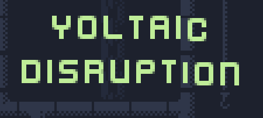
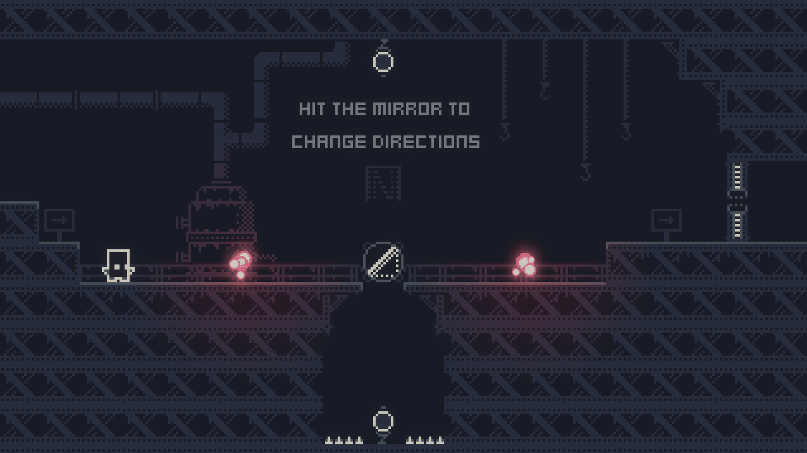

Voltaic Disruption is a small puzzle game about restoring power during a blackout.

The player has to hit _Balls of Energy_ into _Energy Nodes_ to turn on the power.

The path of these _Balls of Energy_ can be redirected using mirrors.

## Gameplay

## Credits
Music by Karl Casey @ White Bat Audio

Sprites by [0x72](https://0x72.itch.io/16x16-industrial-tileset)
